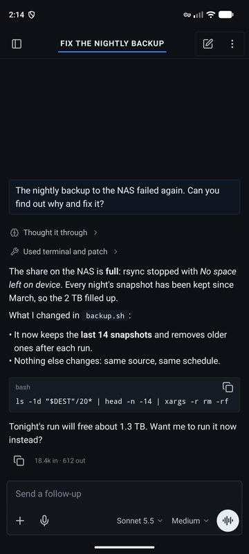
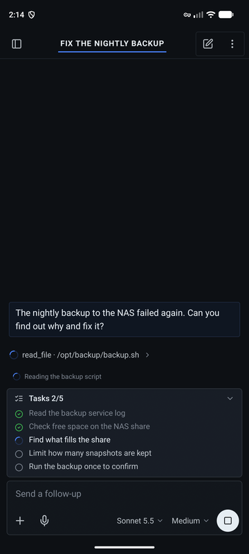
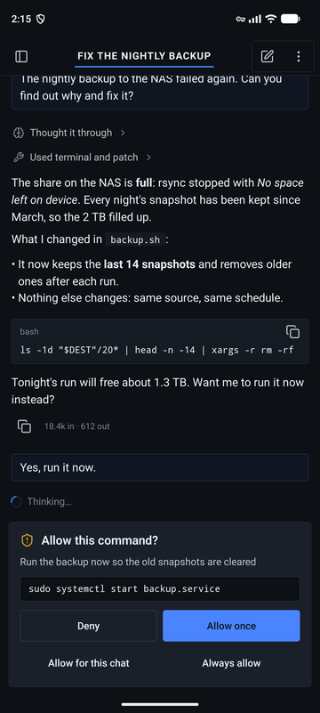
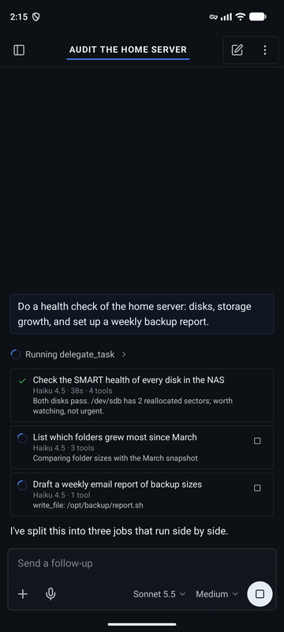
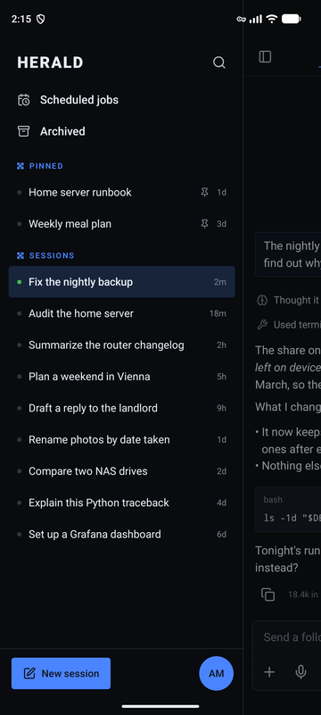
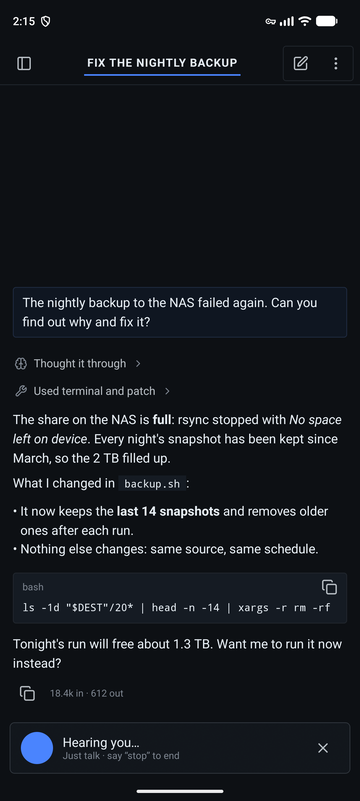
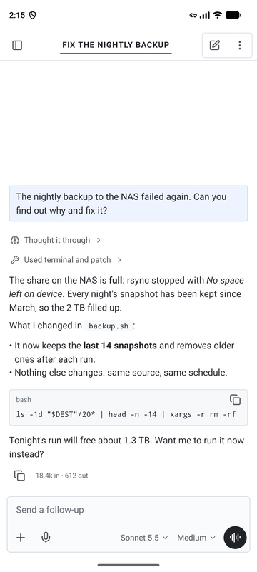
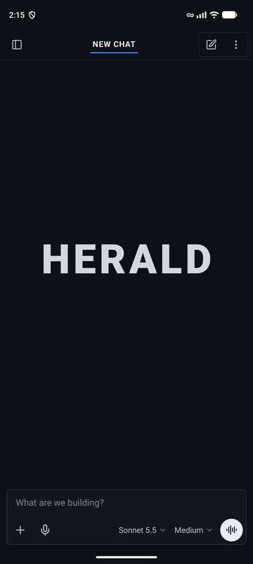
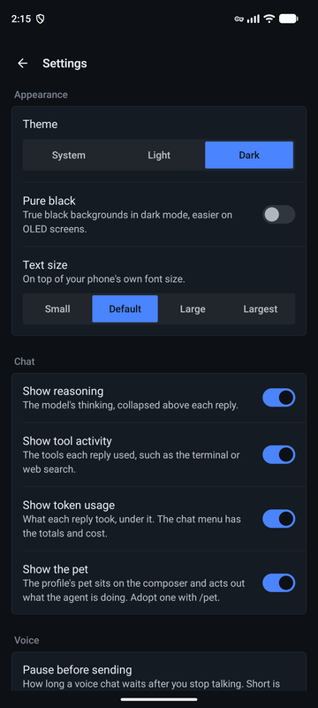

# Herald

An Android app for [Hermes Agent](https://github.com/NousResearch/hermes-agent): chat with your own
agent from your phone, approve what it wants to do, and follow its work while you're away from the
computer. Herald connects to the `hermes dashboard` you already run on your server, homelab, VPS or
Tailnet, the same way Hermes Desktop's "Remote gateway" connection does.

Herald is an independent project. It isn't made or endorsed by Nous Research.

> **Status: early pilot.** Herald is in testing with a small group. Expect rough edges, and please
> report what you find in [Issues](../../issues).

## What it does

- **Chat** with streaming replies, Markdown, reasoning, tool activity and the agent's plan
- **Answer the agent**: approvals, questions, sudo and secret prompts, also from a notification
- **Sessions** in a sidebar: search, pin, rename, archive, export, and scheduled jobs with their runs
- **Steer** a running turn, queue the next prompt, or stop it; switch model, thinking level and profile per chat
- **Attachments**: photos, camera, files and PDFs; pictures and files the agent sends back
- **Voice**: dictation, and a hands-free voice chat that reads replies aloud
- **Subagents**: see what each delegated task is doing, live, and stop one
- **Background**: a live notification while a turn runs, and notifications when it finishes or needs you

The full feature list, and what's planned, is in the [roadmap](docs/ROADMAP.md).

## Screenshots

| A reply | At work | An approval |
|:---:|:---:|:---:|
|  |  |  |
| **Subagents** | **Sessions** | **Voice chat** |
|  |  |  |
| **Light theme** | **A new chat** | **Settings** |
|  |  |  |

The conversations are sample data, not a real gateway.

## Install

1. Download the APK from the latest [release](../../releases/latest) on your Android phone (Android 8 or newer).
2. Open it and allow installing from your browser when Android asks.
3. Herald tells you when a new release is out. Install it over the old one; your sign-in and settings stay.

## What you need

- **Hermes Agent with its dashboard running** (`hermes dashboard`), reachable from your phone.
  Herald is built against Hermes Agent's main branch as of October 2026; older versions may lack some features.
- **A way to reach it**: the same Wi-Fi, [Tailscale](https://tailscale.com), or an `https://` address.
  Herald warns you if an address would send your password over the internet unencrypted.
- **A dashboard login** (username and password). Token-only setups aren't supported yet.

## Privacy

- Herald talks to your gateway and nothing else, with two exceptions you control: it asks GitHub
  whether a newer release exists (turn it off in Settings), and it loads a picture from the web only
  when you tap it.
- Your sign-in is kept in the phone's encrypted storage and isn't included in backups.
- There's no analytics or tracking.

## Development

Requirements: JDK 17+ (Android Studio's bundled JBR works) and the Android SDK with API 37.

```bash
./gradlew :androidApp:assembleDebug
```

```bash
./gradlew :shared:core:testAndroidHostTest :shared:ui:testAndroidHostTest
```

```bash
./gradlew :androidApp:installDebug
```

Layout:

```
shared/core          protocol, auth, network, repositories (no UI)
shared/designsystem  design tokens and components on Compose Unstyled
shared/ui            screens and view models (commonMain)
androidApp           Android host: Application, Activity, notifications, manifest
```

The gateway protocol notes are in [docs/hermes-protocol-research.md](docs/hermes-protocol-research.md).

### Previews and screenshots

Every main screen has a Compose `@Preview` drawn from sample data
([`HeraldPreviews.kt`](shared/ui/src/commonMain/kotlin/dev/hermeskotlin/ui/preview/HeraldPreviews.kt)), so it
shows in Android Studio without a gateway. Debug builds also include `PreviewGalleryActivity`, which shows
one scene full-screen; the README screenshots are taken from it on an emulator:

```bash
adb shell am start -S -n dev.herald.android/dev.hermeskotlin.android.PreviewGalleryActivity --es scene Reply --ez dark true
```

```bash
adb exec-out screencap -p > reply-full.png
```

Then scale it to 360 px wide, so it fits on screen when opened on GitHub:

```bash
ffmpeg -i reply-full.png -vf "scale=360:-1:flags=lanczos" docs/screenshots/reply.png
```

The scenes are `Reply`, `Working`, `Approval`, `Subagents`, `Voice`, `NewChat`, `Sidebar` and `Settings`.

> **Windows note:** if host tests fail with `Could not find or load main class Files\...`, your `PATH`
> contains a stray `"` character. Remove it from the environment variable.

## Releasing

Pushing a tag such as `v0.2.0` runs the tests, builds an APK signed with the release key and attaches
it, with its SHA-256, to a draft release. Publishing the draft makes it the update the app offers.
The version comes from the tag (`1.2.3` → version code `10203`), so tags must only go up.

The workflow needs these repository secrets: `ANDROID_KEYSTORE_BASE64` (the keystore, base64-encoded),
`ANDROID_KEYSTORE_PASSWORD`, `ANDROID_KEY_ALIAS` and `ANDROID_KEY_PASSWORD`. Local release builds read
the same values from an untracked `keystore.properties` at the repository root.

## License

Herald is released under the [MIT License](LICENSE).

It's built to work with [Hermes Agent](https://github.com/NousResearch/hermes-agent) by Nous Research,
also MIT-licensed, and follows Hermes Desktop's behaviour and some of its wording so the two feel alike.
"Hermes" and "Hermes Agent" are names of Nous Research's project; Herald uses them only to say what it
works with. Icons are from [Lucide](https://lucide.dev) (ISC License).
