<div align="center">


# Herald

**A native Android client for [Hermes Agent](https://github.com/NousResearch/hermes-agent).**
Chat with your own agent, approve what it wants to do, and follow its work from your phone.

[](https://github.com/Giton22/herald/releases/latest)
[](#install)
[](#development)
[](LICENSE)
[](https://github.com/Giton22/herald/stargazers)

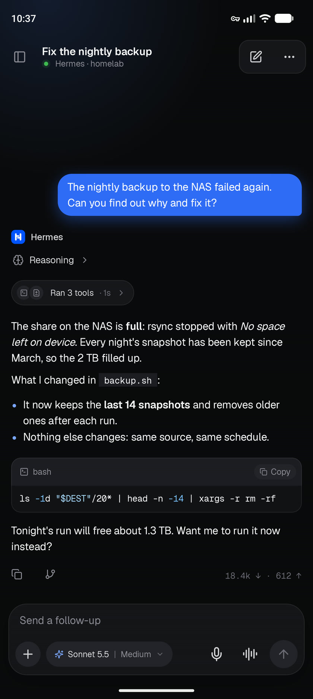&nbsp;
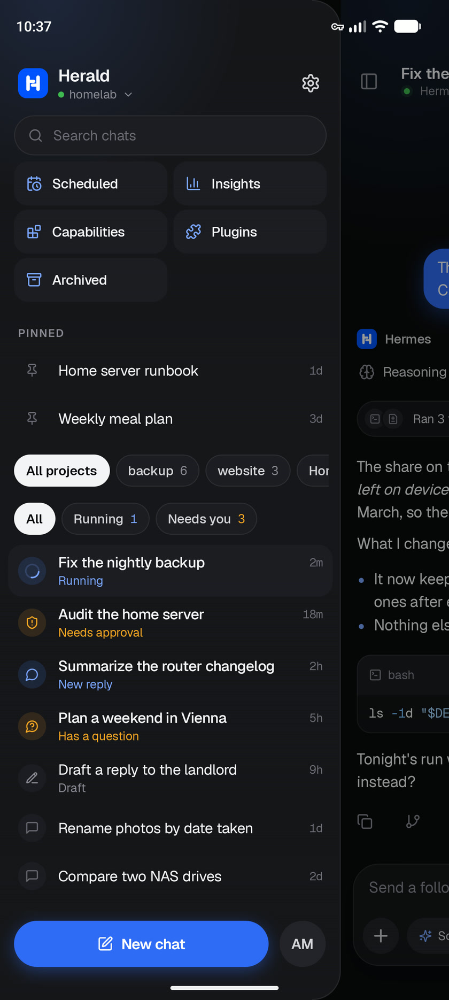&nbsp;
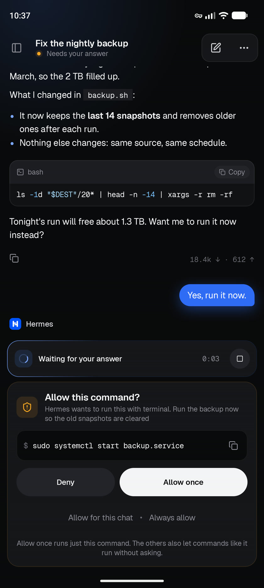

</div>

Herald connects to the `hermes dashboard` you already run on a server, homelab, VPS or Tailnet, the
same way Hermes Desktop's "Remote gateway" connection does. There is no Herald server and no account:
the app talks to your gateway directly.

> [!NOTE]
> Herald is an independent project. It isn't made or endorsed by Nous Research.

## Contents

- [Features](#features)
- [Screenshots](#screenshots)
- [Install](#install)
- [Requirements](#requirements)
- [Privacy](#privacy)
- [Development](#development)
- [Releasing](#releasing)
- [License](#license)

## Features

**Chat**
- Streaming replies with Markdown, syntax-highlighted code, TeX math, reasoning and tool activity
- One live status line for the task at work, with its plan and the running tool
- Send while the agent works: steer the running reply, queue the next prompt, or stop and send
- Select any part of a reply to comment on, explain or ask about on the side
- Copy, edit, regenerate or branch from any message; every chat keeps its unsent draft
- A prompt that may not have arrived can be checked, resent or edited; nothing resends by itself
- Model, thinking level, fast mode and profile per chat, with starred and recent models
- Photos, camera, files and PDFs; pictures and files the agent sends back
- Dictation (on the device or through the gateway), hands-free voice chat and live voice calls

**Control**
- Approvals, questions, sudo, secret and password-manager prompts, also from a notification
- Subagents, background processes and checkpoints: watch, stop and restore
- A chat's cost, token use and what fills its context window

**Organize**
- Sessions sidebar with search, pins, projects, archive, export and Running / Needs you filters
- Bots and rooms: chat with each bot, follow their exchanges, and @mention them in a room
- Scheduled jobs: create, edit, pause and run them, and open each run as a chat
- Capabilities: turn skills, toolsets and MCP servers on or off, and test a server
- Insights: cost, sessions and tokens by day, and the models, tools and skills used most

**Stay connected**
- Notifications when a turn finishes or needs you, with inline approve, answer and reply
- Optional end-to-end encrypted push from outside your network, without Google services
- Several saved gateways, each kept signed in
- An encrypted offline copy of recent chats, readable while the gateway can't be reached
- App lock with fingerprint, face or screen lock

The full feature list, and what's planned, is in the [roadmap](docs/ROADMAP.md).

## Screenshots

| A reply | At work | Subagents |
|:---:|:---:|:---:|
|  | 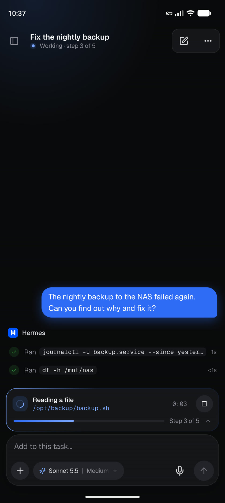 | 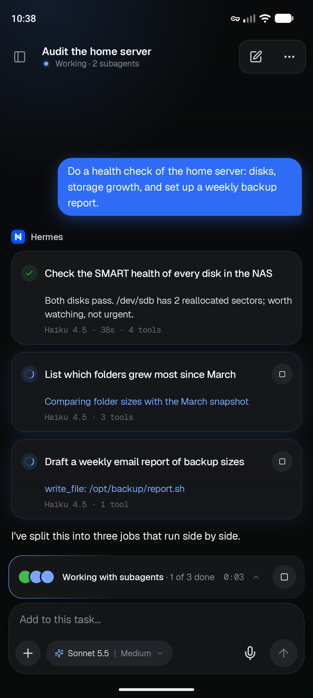 |
| **Delivery check** | **Bots** | **A room** |
| 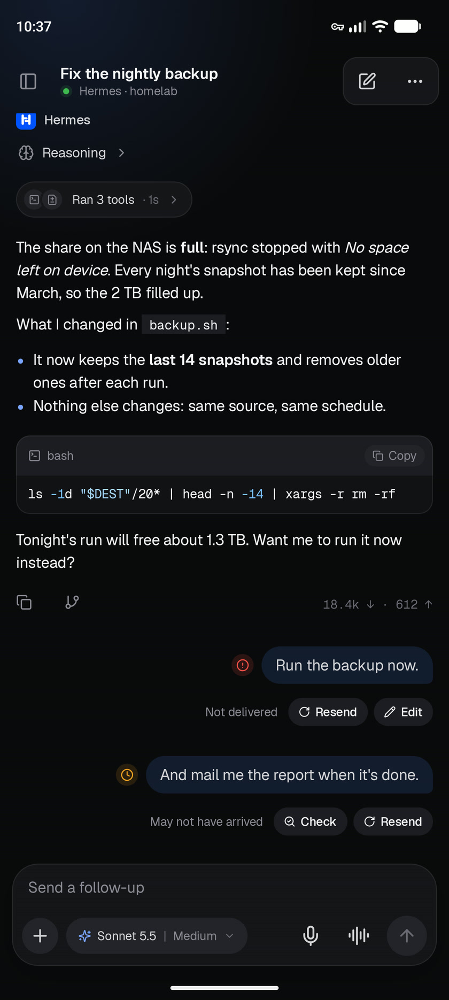 | 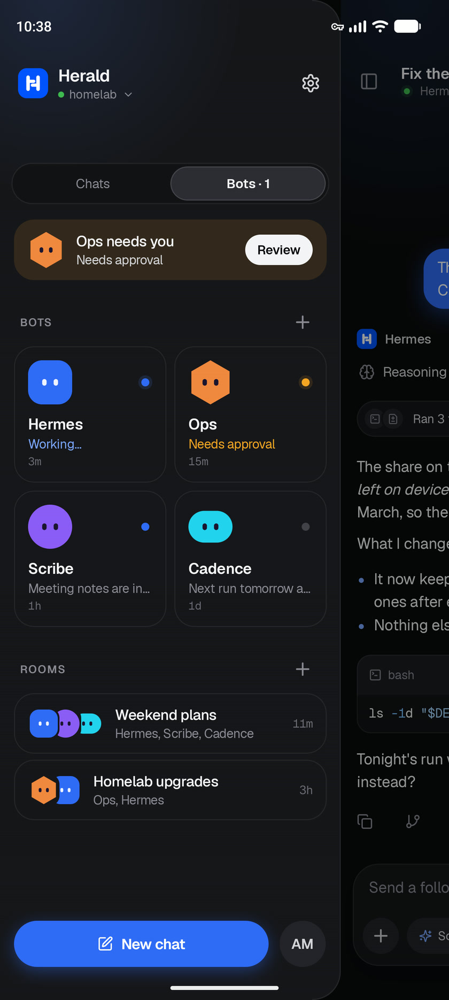 | 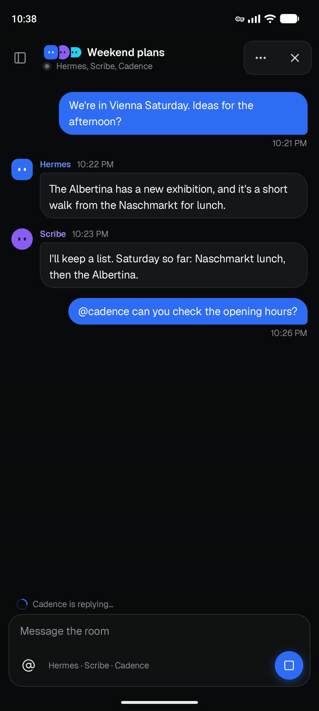 |
| **Voice chat** | **Model picker** | **Usage and context** |
| 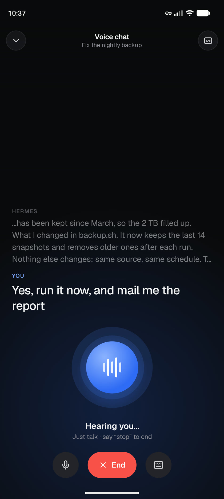 | 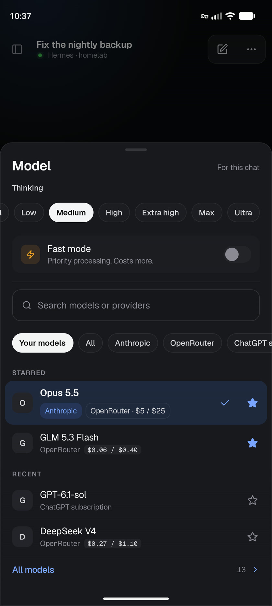 | 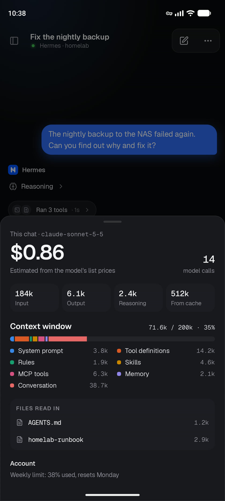 |
| **Background processes** | **Checkpoints** | **Insights** |
| 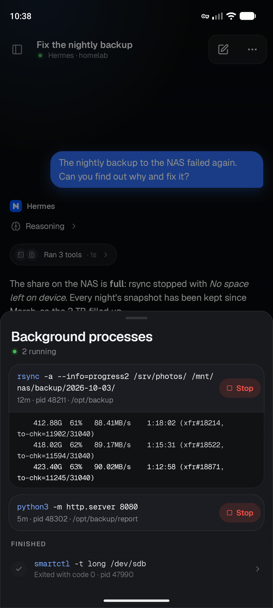 | 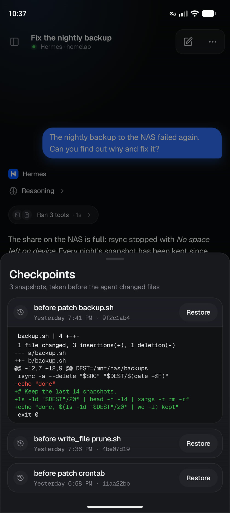 | 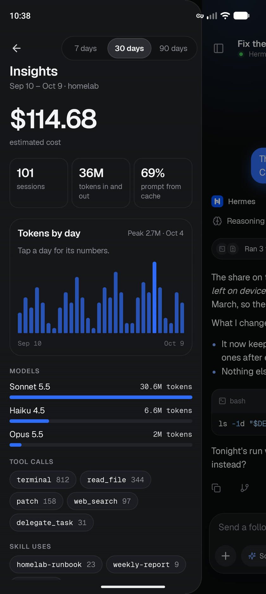 |
| **A scheduled job** | **Capabilities** | **Connect** |
| 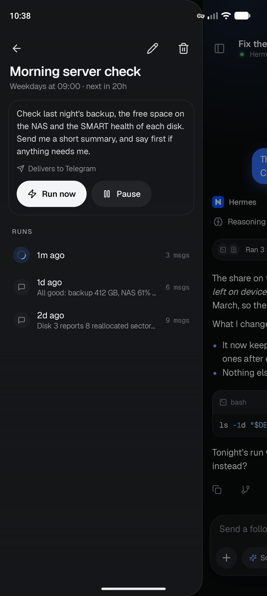 | 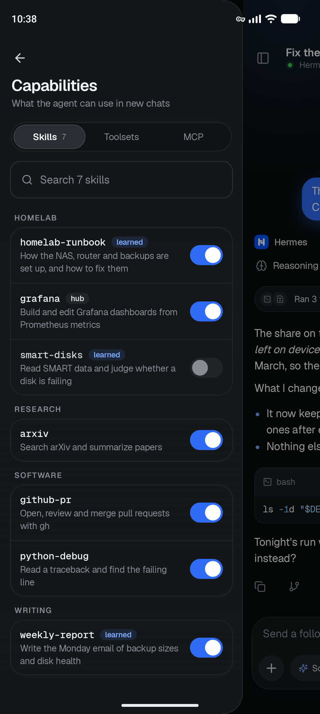 | 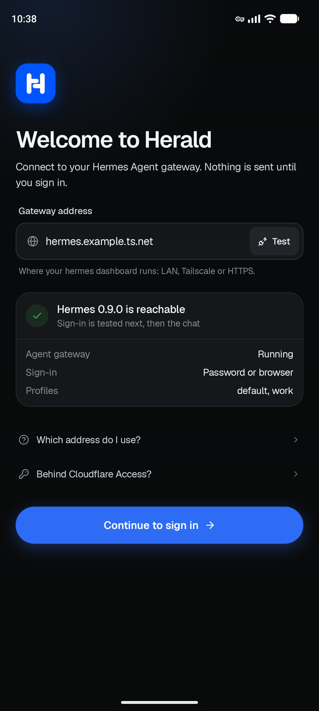 |

<sub>All screenshots show sample data, not a real gateway.</sub>

## Install

1. On your Android phone (Android 8.0 or newer), download the APK from the
   [latest release](https://github.com/Giton22/herald/releases/latest). For almost every phone that is
   the `arm64-v8a` build; the release notes say which fits other devices.
2. Open it, and allow installing from your browser when Android asks.
3. Herald tells you when a new release is out. Install it over the old one; your sign-in and settings stay.

## Requirements

| | |
|---|---|
| **Hermes Agent** | The dashboard running (`hermes dashboard`) and reachable from your phone. Herald is built against Hermes Agent's main branch as of October 2026; older versions may lack some features. |
| **Network** | The same Wi-Fi, [Tailscale](https://tailscale.com), or an `https://` address. Herald warns before it would send a password over the internet unencrypted. Gateways behind Cloudflare Access are supported with a service token. |
| **Sign-in** | A dashboard username and password, or browser sign-in on SSO/OIDC gateways. |

If something doesn't connect, **Settings → Check connection** tests the server, the sign-in and the live
connection one at a time and says what to fix.

## Privacy

- Herald talks only to your gateway, with these exceptions, each under your control:
  - it asks GitHub whether a newer release exists (can be turned off in Settings);
  - it loads a picture from the web only when you tap it;
  - if you install the push plugin, notifications from outside your network go through ntfy,
    end-to-end encrypted and signed.
- Your sign-in and the offline copy of your chats are encrypted with a key held in the Android
  Keystore. App data is excluded from backups.
- No analytics, no tracking.

## Development

**Requirements:** JDK 17+ (Android Studio's bundled JBR works) and the Android SDK with API 37.

Build, test and install a debug build:

```bash
./gradlew :androidApp:assembleDebug
```

```bash
./gradlew :shared:core:testAndroidHostTest :shared:ui:testAndroidHostTest
```

```bash
./gradlew :androidApp:installDebug
```

### Project layout

```
shared/core          protocol, auth, network, repositories (no UI)
shared/designsystem  design tokens and components on Compose Unstyled
shared/ui            screens and view models (commonMain)
androidApp           Android host: Application, Activity, notifications, manifest
```

The gateway protocol notes are in [docs/hermes-protocol-research.md](docs/hermes-protocol-research.md).

### Previews and screenshots

Every main screen has a Compose `@Preview` drawn from sample data
([`HeraldPreviews.kt`](shared/ui/src/commonMain/kotlin/dev/hermeskotlin/ui/preview/HeraldPreviews.kt)), so it
shows in Android Studio without a gateway. Debug builds also include `PreviewGalleryActivity`, which shows
one scene full-screen. The README screenshots are taken from it on an emulator, then scaled to 840 px
wide and saved as JPEG:

```bash
adb shell am start -S -n dev.herald.android/dev.hermeskotlin.android.PreviewGalleryActivity --es scene Reply --ez dark true
```

```bash
adb exec-out screencap -p > reply.png
```

The scene names are the `PreviewScene` values in `HeraldPreviews.kt`, such as `Reply`, `Working`,
`Approval`, `Subagents`, `Sidebar`, `Bots`, `Room`, `Models`, `Insights` and `Settings`.

> [!TIP]
> On Windows, if host tests fail with `Could not find or load main class Files\...`, your `PATH`
> contains a stray `"` character. Remove it from the environment variable.

## Releasing

Pushing a tag such as `v0.3.0` runs the tests, builds APKs signed with the release key and attaches
them, each with its SHA-256, to a draft release: a universal APK and one per ABI, about a third of its
size. Publishing the draft makes it the update the app offers. The version comes from the tag
(`1.2.3` → version code `10203`), so tags must only go up.

The workflow needs these repository secrets: `ANDROID_KEYSTORE_BASE64` (the keystore, base64-encoded),
`ANDROID_KEYSTORE_PASSWORD`, `ANDROID_KEY_ALIAS` and `ANDROID_KEY_PASSWORD`. Local release builds read
the same values from an untracked `keystore.properties` at the repository root.

## Star history

<a href="https://www.star-history.com/?type=date&repos=Giton22%2Fherald">
 <picture>
   <source media="(prefers-color-scheme: dark)" srcset="https://api.star-history.com/chart?repos=Giton22/herald&type=date&theme=dark&legend=top-left" />
   <source media="(prefers-color-scheme: light)" srcset="https://api.star-history.com/chart?repos=Giton22/herald&type=date&legend=top-left" />
   
 </picture>
</a>

## License

Herald is released under the [MIT License](LICENSE).

It's built to work with [Hermes Agent](https://github.com/NousResearch/hermes-agent) by Nous Research,
also MIT-licensed, and follows Hermes Desktop's behaviour and some of its wording so the two feel alike.
"Hermes" and "Hermes Agent" are names of Nous Research's project; Herald uses them only to say what it
works with. Icons are from [Lucide](https://lucide.dev) (ISC License).
